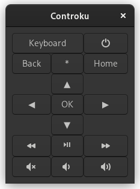
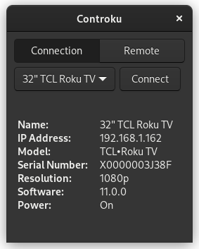

Controku allows you to control Roku devices from your own desktop with a slick GTK3 interface, written in Python.

## Dependencies
* PyGObject
* requests
* [SSDPy](https://github.com/MoshiBin/ssdpy)

## To Do
* Config file to remember Roku devices on network
* Clean up UI
